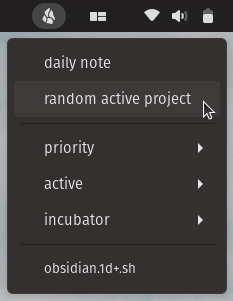

A simple script to tie [Obsidian](https://obsidian.md) to [Argos](https://github.com/p-e-w/argos).

Looks in `~/obsidian` for files tagged with `#projects/priority`, `#projects/active`, and `#projects/incubator`.

Also has a button that opens the notes for a random active project, and one to open today's daily note.

Relies on the daily note and the [Advanced URI](https://github.com/Vinzent03/obsidian-advanced-uri) plugins.

